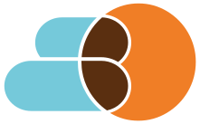
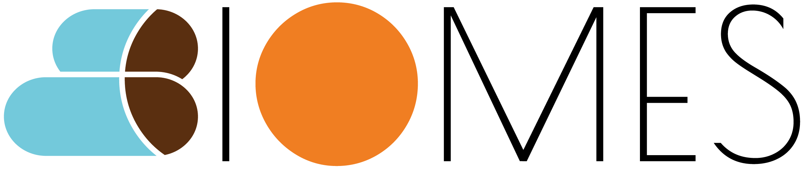
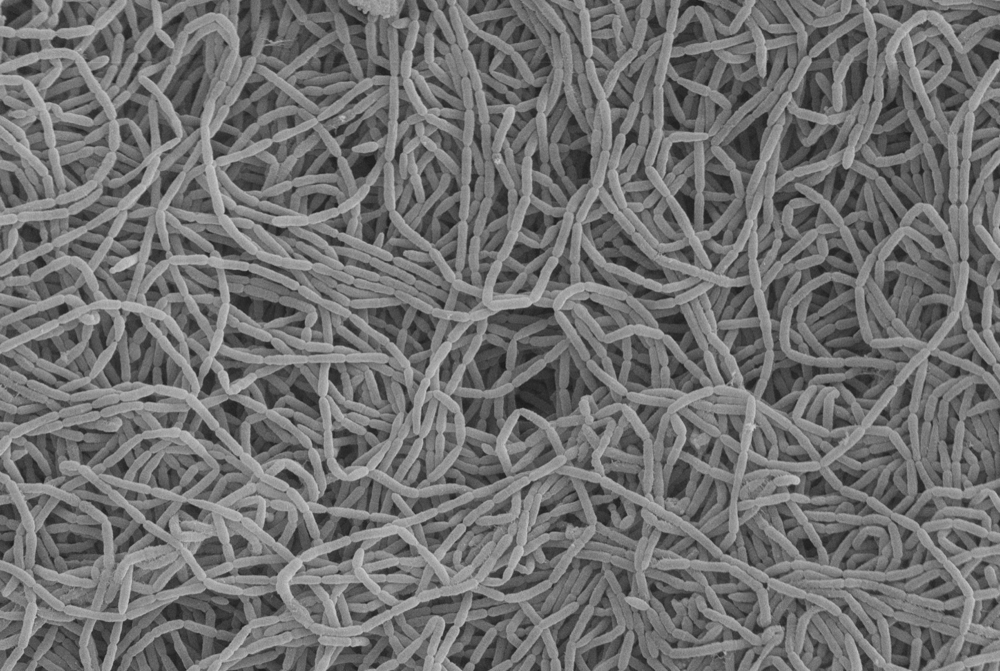

::: {.hero}

{.hero-mark fig-alt="BIOMES emblem"}

{.hero-wordmark fig-alt="BIOMES"}

Bern Intestinal Organisms and Microbial Ecosystems Society

Independent nonprofit association

::: {.hero-plate}
{fig-alt="Scanning electron micrograph of isolate NL0064, Clostridium scindens, at 10,000-fold magnification"}

Isolate NL0064: <em>Clostridium scindens</em> · scanning electron microscopy · 10,000×

:::

:::

::: {.site-prose}

### Welcome to BIOMES

BIOMES is an **independent, nonprofit organisation** dedicated to advancing scientific research in the fields of human microbiota and gastrointestinal health. Our mission is to support and drive innovative research that enhances our understanding and treatment of gastrointestinal disorders and the microbial gut ecosystem.

Founded by a group of passionate scientists and physicians, BIOMES operates without commercial interests, relying on donations and membership fees. This independence enables us to remain focused on our core values of **scientific quality, collaboration, and community impact**.

We are committed to providing high-quality research resources, including biobanks and data, to our members and collaborators. Through partnerships with international research groups, we aim to advance the field of gastrointestinal health and microbiota research, contributing to better diagnostic, preventive, and therapeutic solutions.

Explore our site to learn more about our work, join our community, or discover opportunities for scientific collaboration. Together, we can advance research and improve outcomes in gastrointestinal health and microbiota science.

:::
